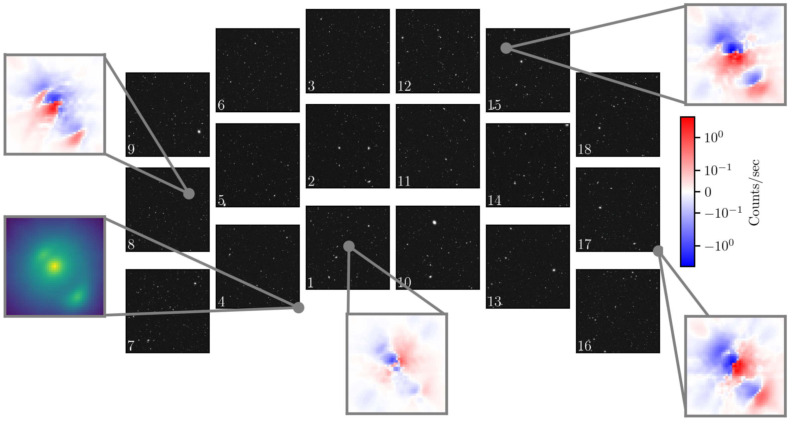

# mejiro

[](https://mejiro.readthedocs.io/en/latest/)
[](https://doi.org/10.3847/1538-4357/adc24f)
[](https://arxiv.org/abs/2506.03390)
[](https://doi.org/10.5281/zenodo.15377389)
[](https://doi.org/10.5281/zenodo.14216839)

`mejiro` ("MEH-ji-roe" or "meh-JI-roe")[^1] is a pipeline to simulate space telescope images of
galaxy-galaxy strong gravitational lenses built
on [SLSim](https://github.com/LSST-strong-lensing/slsim), [lenstronomy](https://github.com/lenstronomy/lenstronomy), [pyHalo](https://github.com/dangilman/pyHalo),
and [GalSim](https://github.com/GalSim-developers/GalSim).


> [!IMPORTANT]  
> `mejiro` will be used to generate >100k simulated Roman images of strong lenses for a **data challenge** in late 2025. Stay tuned!

# Installation

Install `mejiro` v1.0.0 by running:

```
git clone https://github.com/AstroMusers/mejiro.git --branch v1.0.0
cd mejiro
pip install .
```

# Usage

> [!WARNING]
> Please note that `mejiro` >= v2.0.0 involves significant updates, including a new data model. v1.0.0 is intended only for reproducing the results of [Wedig et al. 2025](https://doi.org/10.3847/1538-4357/adc24f).

See the pipeline walkthrough notebook: `examples/pipeline_walkthrough.ipynb`.

To reproduce figures from [Wedig et al. 2025](https://doi.org/10.3847/1538-4357/adc24f), run the corresponding notebook in `paper/figure_notebooks`. For example, to produce the figure below, run `scenes_across_detectors.ipynb`.



Note that some of these figures require supplemental data, which might be generated by a script in `paper/supplemental` and/or the survey and image simulation pipeline which can be executed with the bash script `execute_pipeline.sh`. To set up the configuration file, duplicate a `yaml` file in `config/machine`, edit the `repo_dir` and `data_dir` paths, then set the name of this file in the `defaults.machine` attribute of `config/config.yaml`.

# Citation

If you use `mejiro`, please cite [Wedig et al. 2025](https://doi.org/10.3847/1538-4357/adc24f).

# Acknowledgement

This research was supported by the National Aeronautics and Space Administration (NASA) under grant number 80NSSC24K0095
issued by the Astrophysics Division of the Science Mission Directorate (SMD) and the McDonnell Center for the Space Sciences at Washington University in St. Louis.

[^1]: "mejiro" ([メジロ](https://ja.wikipedia.org/wiki/%E3%83%A1%E3%82%B8%E3%83%AD) in Japanese) or "warbling
white-eye" (*Zosterops japonicus*) is a small bird native to East Asia with a distinctive white ring around the eye,
much like the shape of a strong lens.
