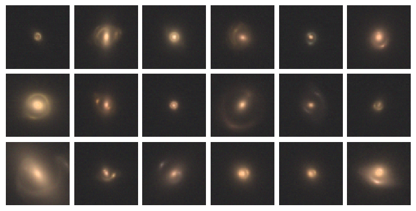

# mejiro

`mejiro` ("MEH-ji-roe" or "meh-JI-roe")[^1] is a pipeline to simulate space telescope images of
galaxy-galaxy strong gravitational lenses built
on [SLSim](https://github.com/LSST-strong-lensing/slsim), [lenstronomy](https://github.com/lenstronomy/lenstronomy), [pyHalo](https://github.com/dangilman/pyHalo),
and [GalSim](https://github.com/GalSim-developers/GalSim).

> [!NOTE]  
> `mejiro` will be used to generate >100k simulated Roman images for the [**Roman Strong Lens Data Challenge**](https://roman-data-challenge.readthedocs.io/en/latest/) in 2026.

# Installation

Install `mejiro` by following [these instructions in the documentation](https://mejiro.readthedocs.io/en/latest/getting_started/installation.html).

# Usage

> [!IMPORTANT]
> ["The Roman View of Strong Gravitational Lenses" (Wedig et al. 2025)](https://doi.org/10.3847/1538-4357/adc24f) was produced with `mejiro` v1.0.0. To review that version of the code, [click here](https://github.com/AstroMusers/mejiro/tree/v1.0.0).

To see how `mejiro` works, see the pipeline walkthrough notebook: `examples/pipeline_walkthrough.ipynb`.

# Citation

If you use `mejiro`, please cite [Wedig et al. 2025](https://doi.org/10.3847/1538-4357/adc24f) and link to [this GitHub repository](https://github.com/AstroMusers/mejiro). Additional citation information can be found in [`CITATION.cff`](/CITATION.cff).

# Acknowledgment

This research was supported by the National Aeronautics and Space Administration (NASA) under grant number 80NSSC24K0095
issued by the Astrophysics Division of the Science Mission Directorate (SMD) and the McDonnell Center for the Space Sciences at Washington University in St. Louis.

[^1]: "mejiro" ([メジロ](https://ja.wikipedia.org/wiki/%E3%83%A1%E3%82%B8%E3%83%AD) in Japanese) or "warbling
white-eye" (*Zosterops japonicus*) is a small bird native to East Asia with a distinctive white ring around the eye,
much like the shape of a strong lens.
