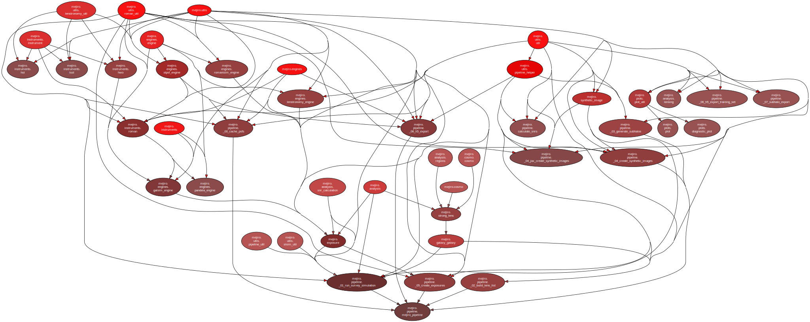

Structure
#########

``mejiro.utils`` are foundational modules that shouldn't call anything else in ``mejiro``. ``mejiro.engines`` wrap a single package. Similarly, ``instruments`` wrap a single package or reference file.

Use ``pydeps mejiro --only mejiro`` to generate the following diagram:

