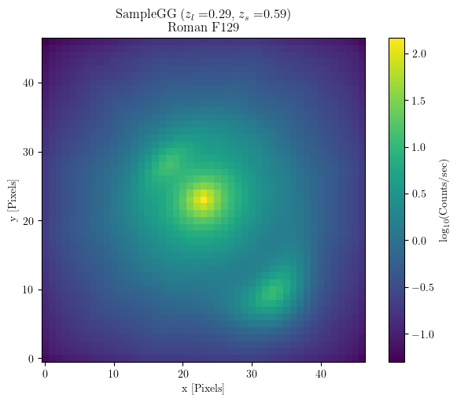

Synthetic Image
===============

A "synthetic image" is the result of ray-shooting and possibly also convolving with a PSF. Importantly, there is no detector noise. The units of the pixels are in counts/sec.

Generating a synthetic image from a strong lens is the first step in simulating the observed image (the "exposure").

.. code-block:: python

    from mejiro.galaxy_galaxy import SampleGG
    from mejiro.instruments.roman import Roman
    from mejiro.synthetic_image import SyntheticImage

    strong_lens = SampleGG()

    synthetic_image = SyntheticImage(strong_lens=strong_lens,
                                    instrument=Roman(),
                                    band='F129',
                                    fov_arcsec=5)
    synthetic_image.plot()

This produces the following figure:

``synthetic_image``
*******************

.. automodule:: mejiro.synthetic_image
    :members:
    :undoc-members:
    :show-inheritance: